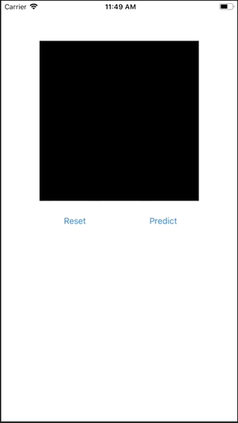

# MNIST with CoreML and Vision Framework

<p align="center">
    
</p>

This is an example of MNIST in iOS.

## How to train the model

### Requirements

 - [Keras][]
 - [Tensorflow][]
 - [coremltools][]

[Keras]: https://keras.io/#installation
[Tensorflow]: https://www.tensorflow.org/install/
[coremltools]: https://pypi.python.org/pypi/coremltools

### Training and converting

```bash
cd train
python train.py
python convert.py
```
